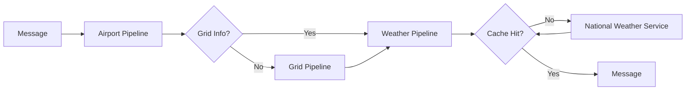

# Capstone

At a high level, this project aims to get weather forecasts for airports in the United States.

Send a JSON message `{"city": "Austin", "state": "TX"}` to the [RabbitMQ](https://www.rabbitmq.com) queue `airport_pipeline`.
All airports in that city will be loaded from [PostgresSQL](https://www.postgresql.org) using [Ecto](https://hexdocs.pm/ecto/Ecto.html).
If the airport does not have an assigned [National Weather Service](https://www.weather.gov/documentation/services-web-api) grid, we lookup the grid and save it with the airport record.
We then check the weather for that grid in our local cache (which uses [dets](https://www.erlang.org/doc/man/dets.html)).
If the cache misses, we'll fetch the latest weather from the National Weather Service; otherwise, we send out the cached result.
You can receive the weather for every airport in the city by subscribing to the `weather_pipeline` queue.
The entire data-ingestion pipeline is wired together with [Broadway](https://elixir-broadway.org).



There is no real practical use for the project; it is just a capstone to reinforce learning from these books:

- [Concurrent Data Processing in Elixir](https://pragprog.com/titles/sgdpelixir/concurrent-data-processing-in-elixir/)
- [Programming Ecto](https://pragprog.com/titles/wmecto/programming-ecto/)
- [Testing Elixir](https://pragprog.com/titles/lmelixir/testing-elixir/)

## Setup

```
%> docker run --hostname rabbitmq --name rabbitmq -p 5672:5672 -d rabbitmq
%> docker run -e POSTGRES_DB=capstone -e POSTGRES_USER=capstone -e POSTGRES_PASSWORD=capstone \
   --name postgres -p 5432:5432 -d postgres
%> mix setup
```

Setup will run migrations and kick off the seeding of airport data.
It will first check for the presence of a CSV file containing airport data.
If the file does not exist, it will download and save the file.
It then loads and parses the file in a [stream](https://hexdocs.pm/elixir/1.12/Stream.html), validates each airport record against a [schema](https://hexdocs.pm/ecto/Ecto.Schema.html), and inserts the airports in batches of 100.
The process is idempotent and only takes a matter of seconds (mostly downloading the file).

## Usage

```
%> iex -S mix
```

```elixir
iex> channel = lookup.("Austin", "TX")
iex> AMQP.Channel.close(channel)
```

You can reset the data at any time with:

```
%> mix reset
```